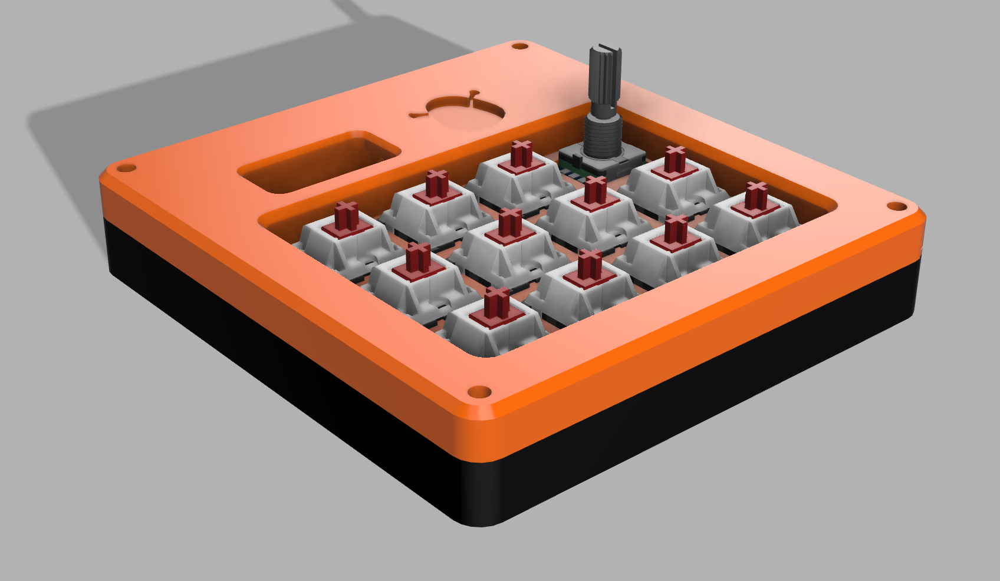
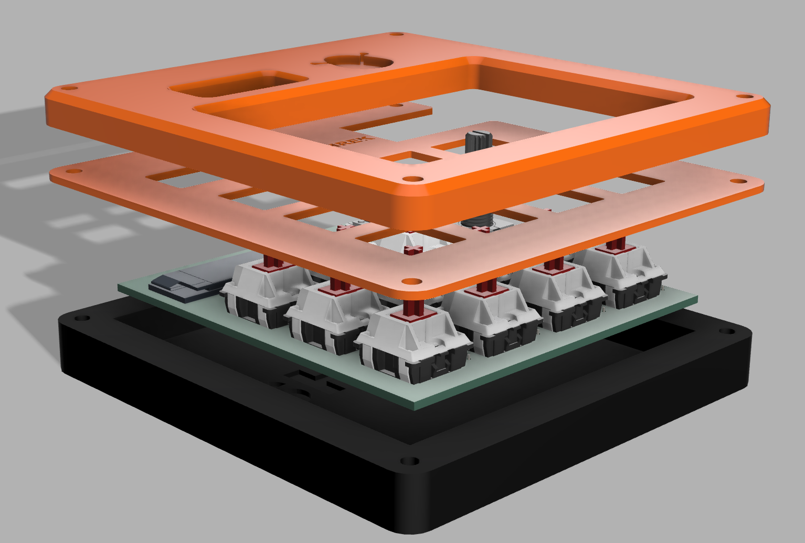
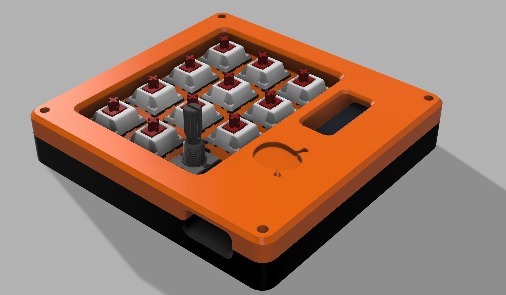
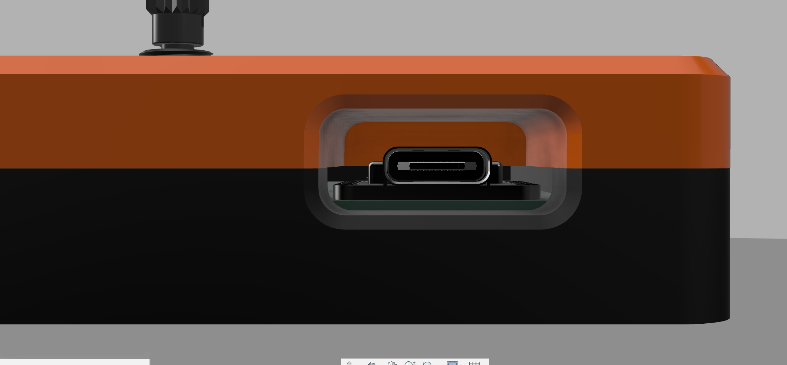
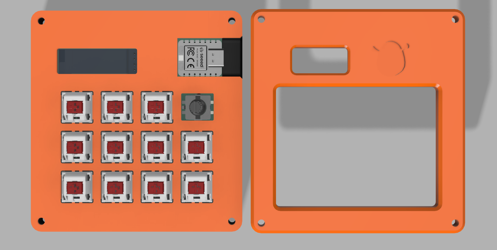
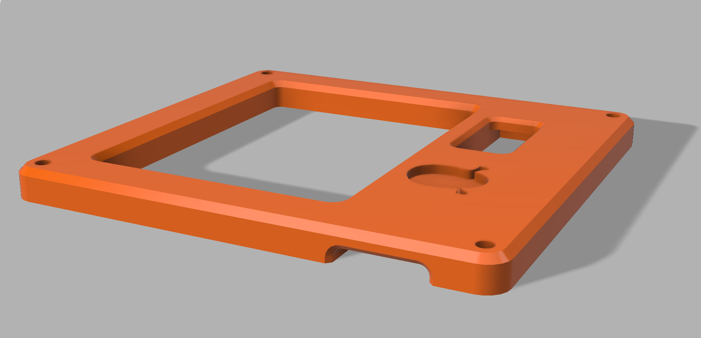
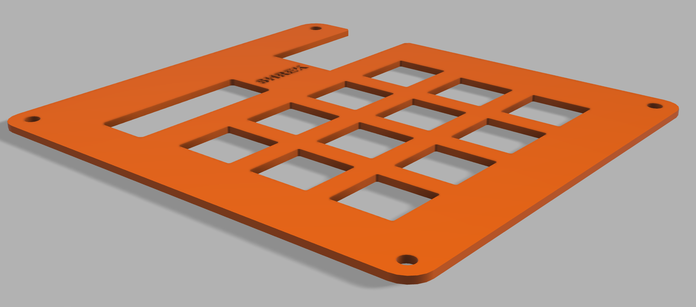
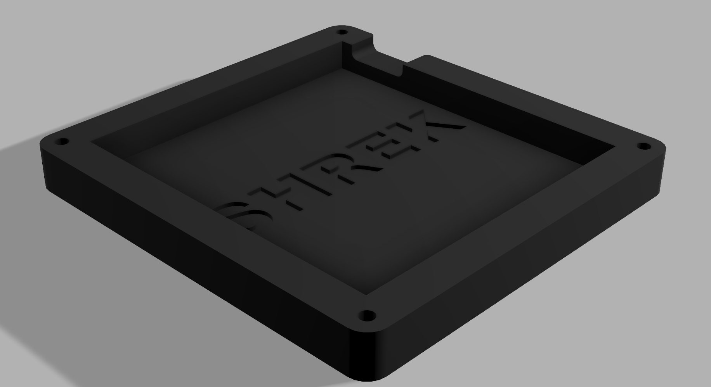
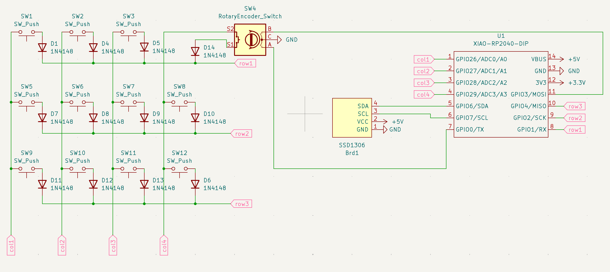
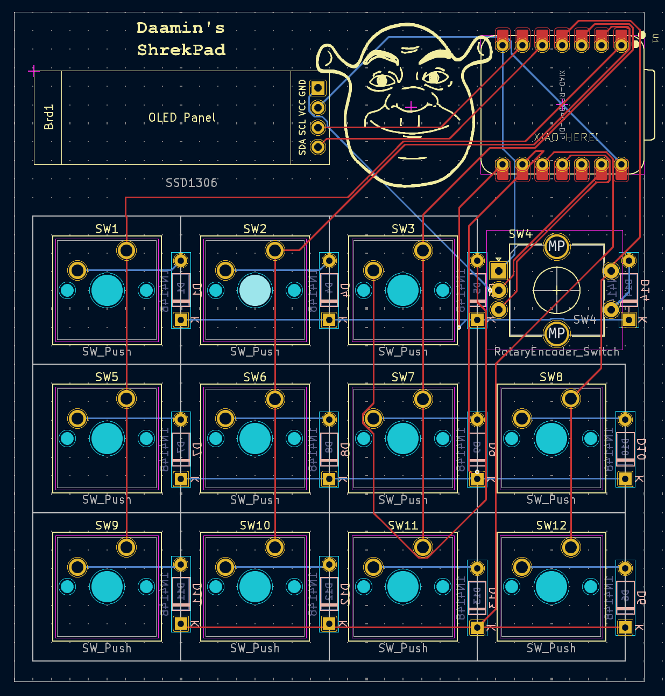

# Daamin's ShrekPad

### Inspiration

I wanted to boost my productivity and add an aesthetic looking device to my desk setup.

### Challenges

Believe it or not, this was my first time using Fusion 360! I spammed ChatGPT and #hackpad with queries. It also took me a lotta time making the PCB and routing it 😭. I had to reroute a hundred times.

### Case

The case features a very hot Orange and Black look with the keycaps being black and Knob being orange too.

Branding: There is a "Shrek" engraving on both the bottom and middle plate. The top case features an engraving of Shrek's face.

Thickness

- Top: 7mm
- Middle: 1.5mm
- Bottom: 11.5mm
- **Total:** 20mm

### Specifications

BOM:

- 11x Blank DSA Keycaps (11x Black)
- 11x Cherry MX Switches
- 12x 1N4148 diodes
- 1x XIAO RP2040
- 4x M3x20 Bolt ([not available at HQ? if not, then buy from here.](https://amzn.in/d/27J4X2p))
- 4x M3 Nuts
- 4x M3 Heatset
- 1x SSD1306 128x32 0.91" OLED (5V VCC, 3.3V logic, I2C)
- 1x EC11 Rotary Encoder
- 1x Rotary Encoder Knob
- 1x PCB (Please choose "Black" color while ordering 🙃)
- 1x Case (I would like both the TOP and MIDDLE to be printed in Orange and BOTTOM in Black, if not available: Message me @Daamin on Slack)

Others:

- KMK Firmware
- TOP.step
- MIDDLE.step
- BOTTOM.step

|           Schematic            |           PCB            |            Case            |
| :----------------------------: | :----------------------: | :------------------------: |
|  |  |  |

Notes:
Top and Middle printed in Orange, Bottom with Black.
PCB Color has to be black too.
